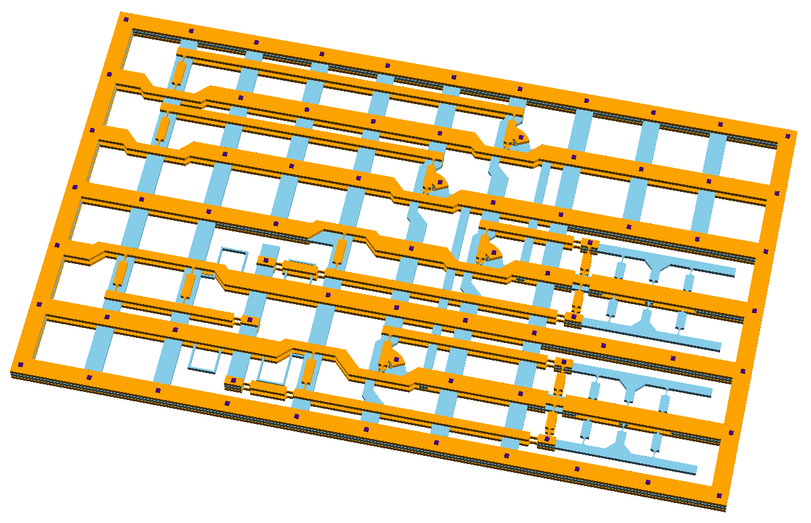
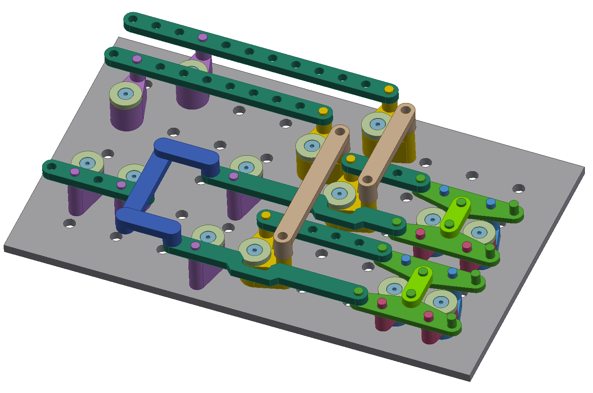
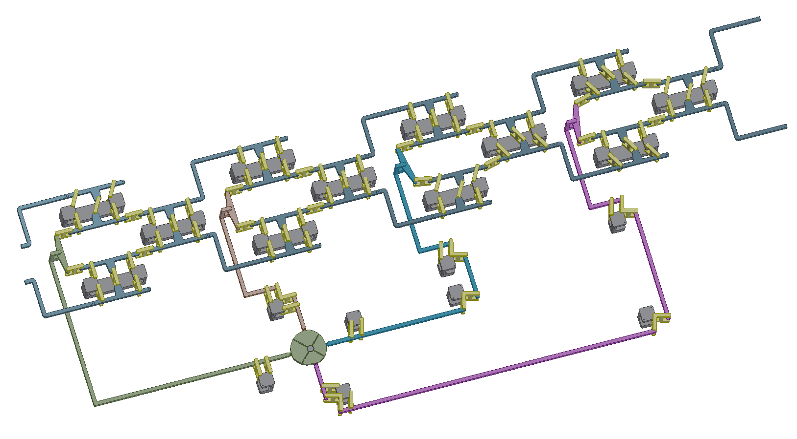
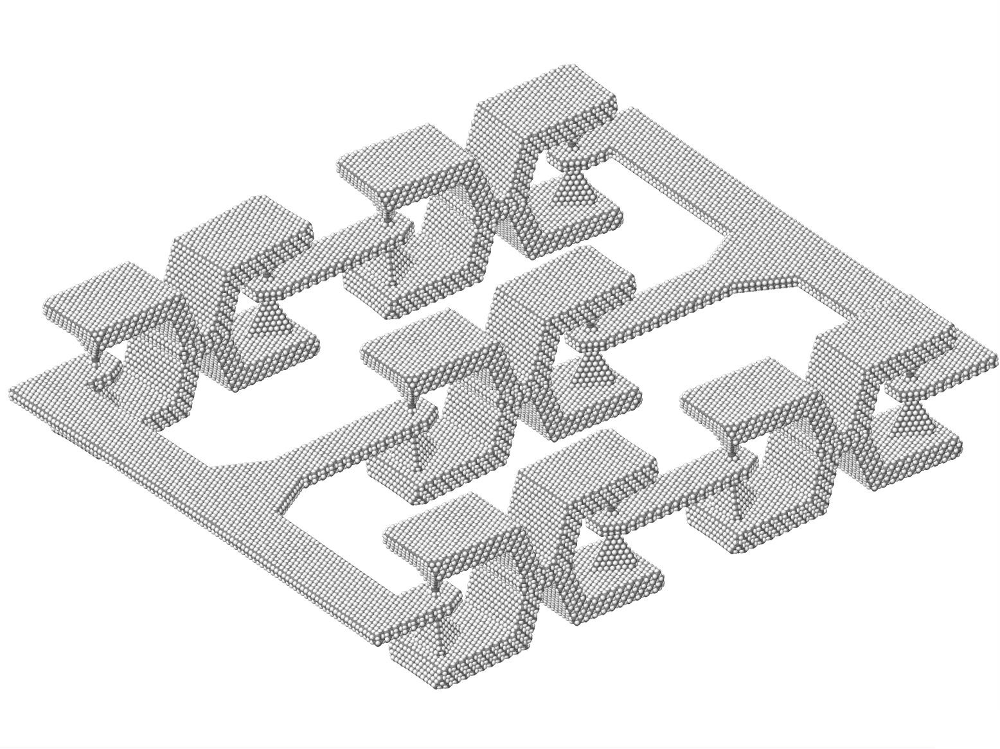

## Mechanical Computing Systems

This repo contains solid models of mechanical computing elements described in the paper:

[Mechanical Computing Systems Using Only Links and Rotary Joints](http://mechanismsrobotics.asmedigitalcollection.asme.org/article.aspx?articleid=2697887)  
*Journal of Mechanisms and Robotics*  
**10(6), 061006 (Sep 17, 2018)**  
**Paper No: JMR-17-1426; doi: 10.1115/1.4041209**  
Ralph C. Merkle, Robert A. Freitas Jr., Tad Hogg, Thomas E. Moore, Matthew Moses, and James Ryley  

[**Flexure-based Designs**](/flexures)

[**3D Printable Models**](/CAD_models)

[**4-cell Shift Register**](/shift_register)

[**Atomistic Models**](/atomistic_models)

