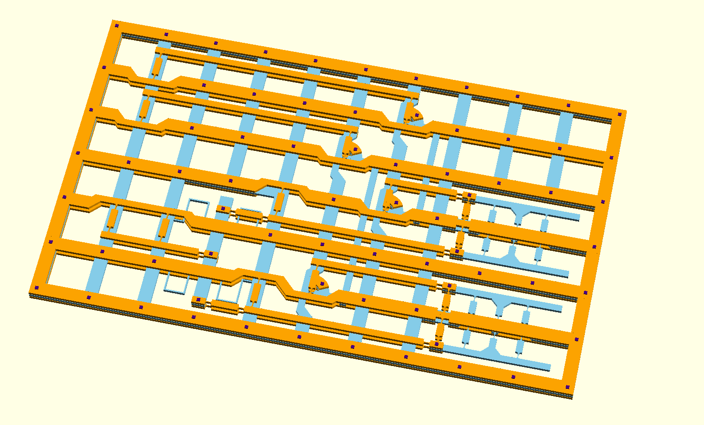

## Mechanical Computing Systems

This repo contains solid models of mechanical computing elements described in the paper:

[Mechanical Computing Systems Using Only Links and Rotary Joints](http://dx.doi.org/)    
*Journal of Mechanisms and Robotics*     
Ralph C. Merkle, Robert A. Freitas Jr., Tad Hogg, Thomas E. Moore, Matthew Moses, James Ryley (2018)

**Flexure-based Designs**

**3D Printable Models**     
[3D Printable Models here](/CAD_models)

**CAD Models of a 4-cell Shift Register**

**Atomistic Models**
